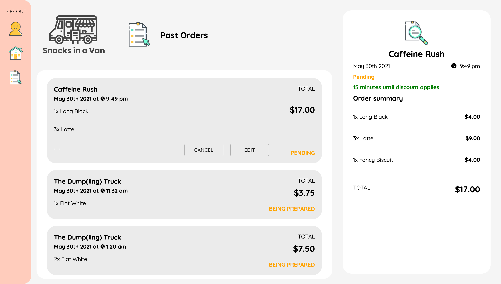

**INFO30005 Web Information Technologies**

**404 Incorporated's**
# Snacks in a Van Web App - Frontend Website

This is the project repository for 404 Inc.'s (T18 Group 2) implementation of the Snacks in a Van Web App.

> Note: for marking deliverable 4, please skip straight away to the **frontend** section by clicking on it in the table of contents. Or, simply [click here](#frontend). This will give instructions for how to navigate the website and some sample login credentials to use. For information about the backend database, including credentials to access the MongoDB database on Atlas, please open the backend server repository, a link to which can be found in the **backend** section [ here](#backend).

<br/>

## Running locally
To run the website locally, simply choose your package manager of choice and run using the appropriate commands. For example using npm, install the required packages and run the app using the following commands:
```
npm install
npm start
```

## Table of contents
* [General Info](#general-info)
* [Project Deliverables](#project-deliverables)
* [Technologies](#technologies)
* [Frontend](#frontend)
* [Backend](#backend)

## General info
---

This project builds a fully functioning Web App for the startup company Snacks in a Van. The company runs a fleet of food trucks that act as popup cafes. The app has two main users with a different set of use case:
* Customers
  * Find vans relative to their location
  * View the menu of available snacks
  * Place orders at vans (that can be modified)
  * Track the status of all ongoing and past orders
  * General account creation and management features
* Vendors
  * Set the location of their van and mark
  * Mark themselves as open or closed for customers
  * Track orders made by customers
  * Update those orders accordingly

Based on the business requirements specificed, the following App Diagram below was made to model the pages and interactions of the user:


[*Table of Contents*](#table-of-contents)

<br/>

## Project Deliverables
---
|      Task      | Leading Members     |    Status   |
| :------------: | :-------------:     | :---------: |
| UI Design      | Fiona & Vishesh     | Complete    |
| Web Server V1  | Wilbert & Irgio     | Complete    |
| Front End V1   | Sam, Fiona, & Irgio | Complete    |
| Full Web App   | All Members         | Complete    |
| Project Report | Wilbert & Vishesh   | Complete    |

[*Table of Contents*](#table-of-contents)

<br/>

## Technologies
---
This project is (currently) created with:
* NodeJs 16.0.0
* React 17.0.2
* React Router 5.2.0
* React Scripts 4.0.3
* Material UI 4.11.X
* Axios 0.21.1
* Google Maps React 2.0.6
* Haversine Distance 1.2.1
* Moment 2.29.1

[*Table of Contents*](#table-of-contents)

<br/>

## Backend
---
The backend runs the server that interacts with the MongoDB database and handles all data upload and retrieval. The web app interacts with the backend server through its API endpoints. The Web Server is hosted on Heroku and can be found [here.](https://webit-project-404inc-backend.herokuapp.com/) For more information about the backend server, how it works, and documentation on every endpoint, please visit the backend repository [here.](https://github.com/INFO30005-2021-SM1/project-t18-404-inc) The rest of this README will be discussing the web app from the perspective of the frontend.

[*Table of Contents*](#table-of-contents)

<br/>

## Frontend
---
To access the web app, simply visit the following website: https://snacks-in-a-van-404inc.herokuapp.com/. Going onto the root page will bring you to the customer home screen.

#### *Customer App*

>Note: some screens that are practically the same for both the desktop and mobile (in particular the popup) have been omitted. That is, if a screen looks mostly identical for both mobile and desktop, only one is included

On the customer home screen, the user can choose to login to their account or to select a van on the main map. 

>Customer Login Credentials <br/>
Email: blue@blue <br/>
Password: p@ssw0rd <br/>


Home (Desktop) |  Home (Mobile) | Van Select (Mobile) |
:-:|:-:|:-: 
 |  |  

After selecting a van the user is able to view the menu items available for purchase, though none can be selected until the user logs in. After logging in, the user can add menu items to their cart and once satisfied, confirm their order. 

Menu (Desktop) |  Menu (Mobile) | Cart (Mobile) | Confirm Order (Mobile) |
:-:|:-:|:-:|:-:
 |  |  | 

After confirming the order the user will be redirected to their orders page where they can view the status of on-going orders as well as past orders. Once they've received their order and the vendor marks their order as complete, the customer can rate their experience and re-view their past orders whenever they want. 

Orders (Desktop) |  Orders (Mobile) | Single Order (Mobile) | Rating (Mobile) |
:-:|:-:|:-:|:-: 
 |  |  | 

The user is also able to view their profile, where they can update their name and password if they wish.

Profile (Desktop) |  Update Password (Mobile) |
:-:|:-:
 |  |

#### *Vendor App*
At https://snacks-in-a-van-404inc.herokuapp.com/vendor/, vendors are able to log in or register their vans to the app.

Login |  Login Popup |
:-:|:-:
 |  |

After logging in they are greeting to a screen with their current location. On this screen they set their location details and can open the van for the day. 

>Vendor Login Credentials <br/>
Van Name: AutoBUN <br/>
Password: password <br/>


Opening the van redirects the vendor to an order management page where they can view ongoing orders. From here they can update the status of orders as they proceed in the process of making them. Once the vendor is done for the day, they can simply click to close the van and log out for the day.

Orders |  Filter Orders |
:-:|:-:
 |  |

[*Table of Contents*](#table-of-contents)

<br/>
